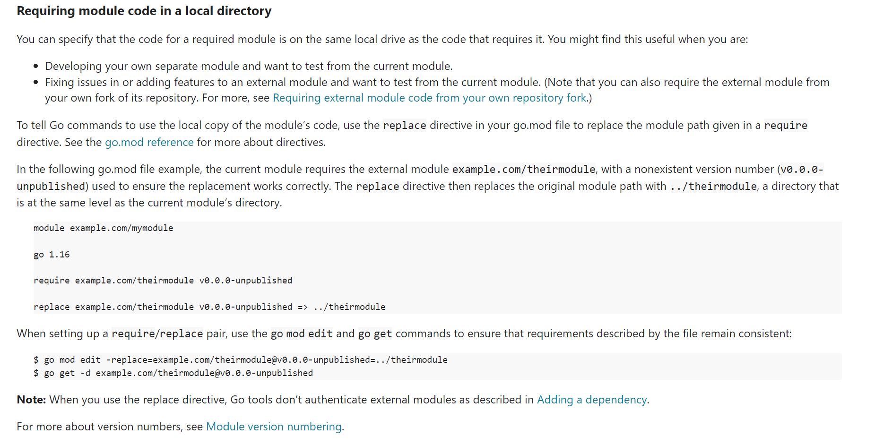

Github do curso: [https://github.com/OtavioGallego/curso-golang](https://github.com/OtavioGallego/curso-golang)

# Comandos básicos:

`go init {NOME_MODULO}` cria um modulo

OBS: Um módulo é um conjunto de arquivos dentro de uma pasta, ou seja, para cada pasta deve-se criar um arquivo `go.mod`

`go build` builda o projeto e gera o executável

`go get {NOME_PACOTE}` Obtém um pacote para o projeto exemplo: `go get github.com/badoux/checkmail`

`go get {NOME_PACOTE}@none` Remove pacote específico

`go list -m -u all` lista todos os módulos utilizados também exibindo suas últimas versões

`go list -m -u example.com/theirmodule` Lista modulo especificado e sua última versão

`go mod tidy` remove todos os pacotes que não estão sendo mais utilizados.

`go test` executa os testes do pacote que esta no path do terminal

`go test ./...` Executa todos os pacotes dentro de todas as paths com base no path do terminal

`go test -v` Executa os testes em modo `verbose`

`go test --cover` Executa os testes com cobertura

`go test --coverprofile {NOME_ARQUIVO}` Executa os testes com cobertura e gera em um arquivo `txt`

`go tool cover --func={NOME_ARQUIVO}` Executa o arquivo de cobertura e traz o resultado de maneira mais visível, no terminal

`go tool cover --html={NOME_ARQUIVO}` Executa o arquivo de cobertura e traz o resultado de maneira mais visível, em html.

OBS: O Go faz cache dos testes e quando não há alteração no teste nem no método que está sendo testado.

# Testar pacote local 

# Links Úteis

## Gerenciado dependências GO:
[https://go.dev/doc/modules/managing-dependencies](https://go.dev/doc/modules/managing-dependencies)

## Publicando pacote GO:
[https://go.dev/doc/modules/publishing](https://go.dev/doc/modules/publishing)

## Reflexão GO:
[https://go.dev/blog/laws-of-reflection](https://go.dev/blog/laws-of-reflection)